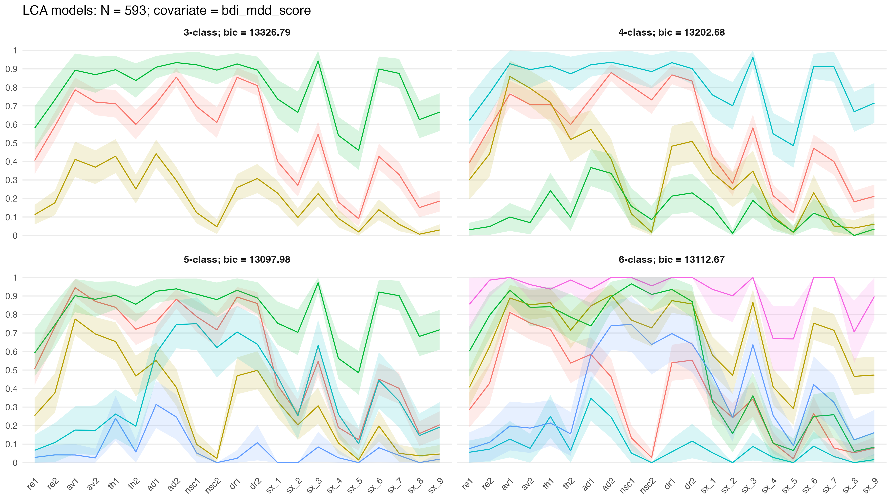

# Latent class analysis of complex post-traumatic stress disorder in South African undergraduates

Analysis of data collected in 2021-2022 from three universities across South Africa, including symptoms of
- post-traumatic stress
- borderline personality
- depression
- childhood trauma

Model estimation is implemented in R using [poLCA](https://github.com/dlinzer/poLCA). Raw dataset is witheld to ensure the anonymity of participants.

